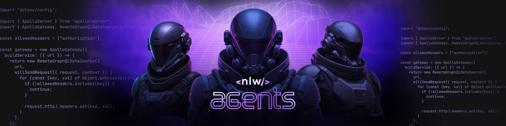
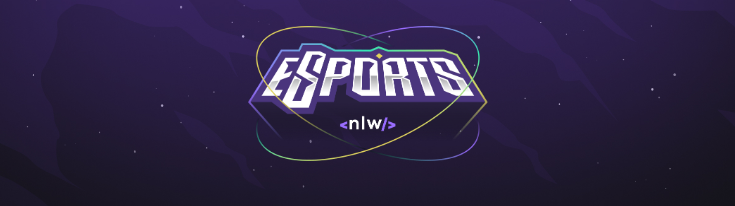

  

<h1 align="center">Projeto E-Sports</h1>

Evento gratuito da Rocketseat, com foco em desenvolvimento web e criação de um assistente de IA para gamers! 🚀

  <a href="#-tecnologias">Tecnologias</a>&nbsp;&nbsp;&nbsp;|&nbsp;&nbsp;&nbsp;
  <a href="#-projeto">Projeto</a>

  

 

## 🚀 Tecnologias

Esse projeto foi desenvolvido com as seguintes tecnologias:

- HTML
- CSS
- JavaScript
- Git e Github
- Gemini AI

 

## 💻 Projeto

Nesta edição do NLW, vou construir um projeto clássico do NLW eSports com uma pegada totalmente nova e inteligente! Partiu criar um Assistente de IA para Gamers! 🎮

Imagine um aplicativo com design moderno e animações, que te auxilia nos jogos e dá dicas de estratégia em tempo real, tudo isso usando a API do Gemini como o cérebro do nosso assistente.
 

  

 

<h2 align="center">📌 Desenvolvedores</h2>

<table align="center">
  <tr>
    <td align="center">
      <a href="https://github.com/rebellatoGui" title="GitHub">
         
        
          <b>Guilherme Rebellato</b>
        
      </a>
    </td>
  </tr>
</table>

 

---

Feito com 💜 pela <b>Rocketseat<b>

  

